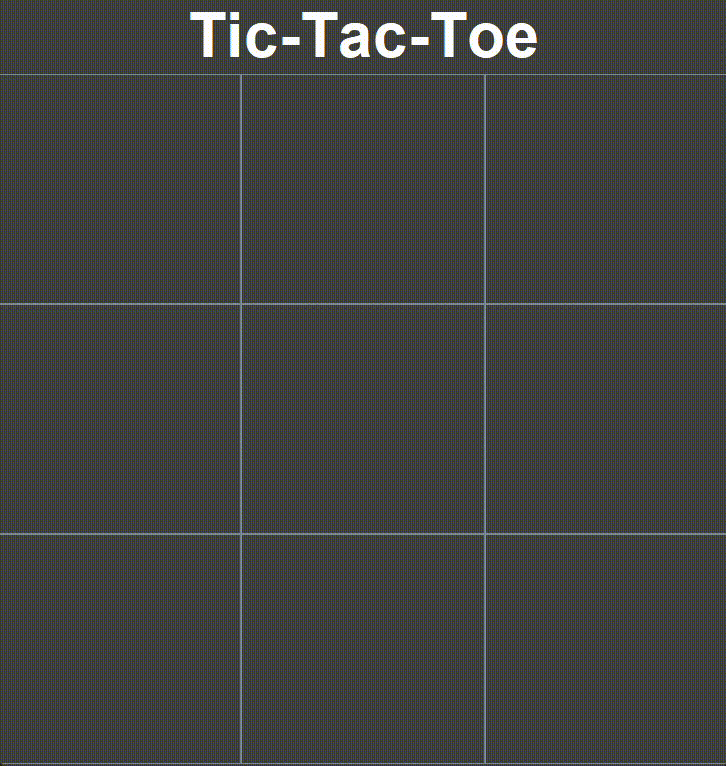

# Tic-Tac-Toe Game

This is a simple implementation of the classic **Tic-Tac-Toe** game using Java and Swing for the graphical user interface (GUI). The game is designed to be easy to use and provides a fun way to practice Java GUI programming.

## Features

- **Two-player game**: Play with a friend by taking turns.
- **Interactive UI**: Uses buttons for the game board and dynamically updates the turn indicator.
- **Winner detection**: Automatically detects and announces the winner.
- **Tie detection**: Declares a tie if the board is full and there is no winner.
- **Clean design**: Simple and visually appealing UI.

## How to Run

1. Make sure you have **Java Development Kit (JDK)** installed (JDK 8 or later).
2. Copy the source code to your local machine.
3. Compile the code:
   ```bash
   javac TicTacToe.java

## Demo
